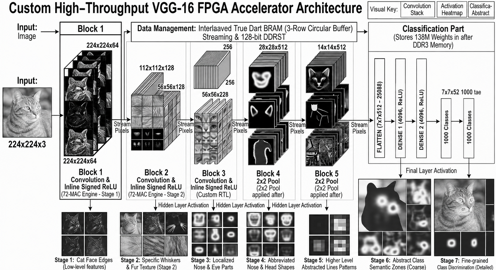
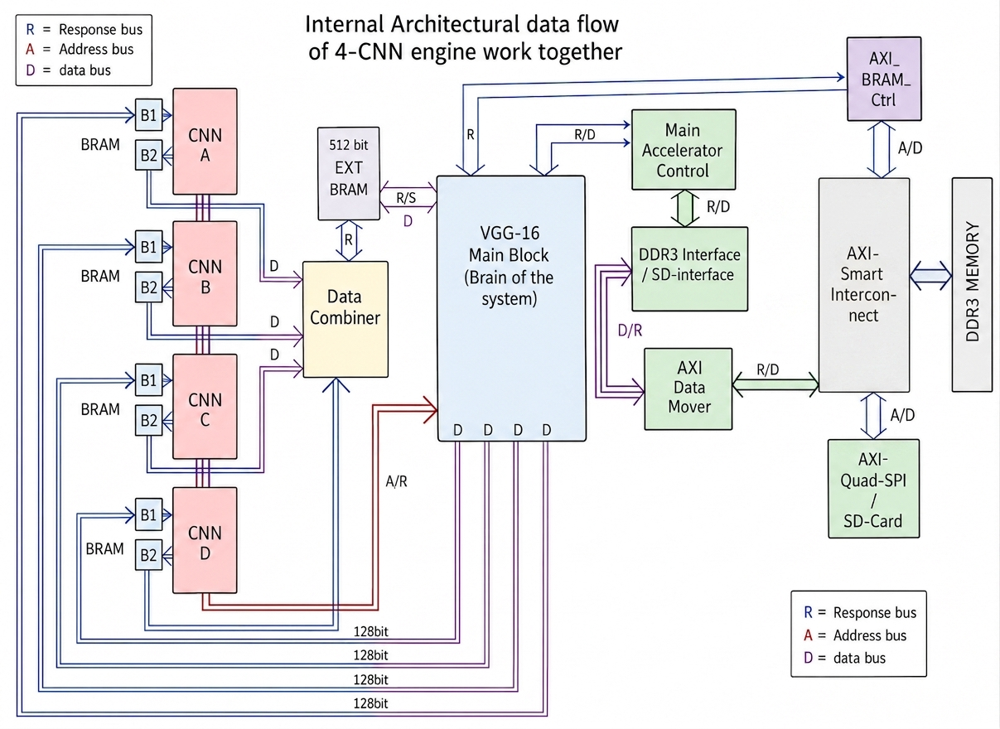
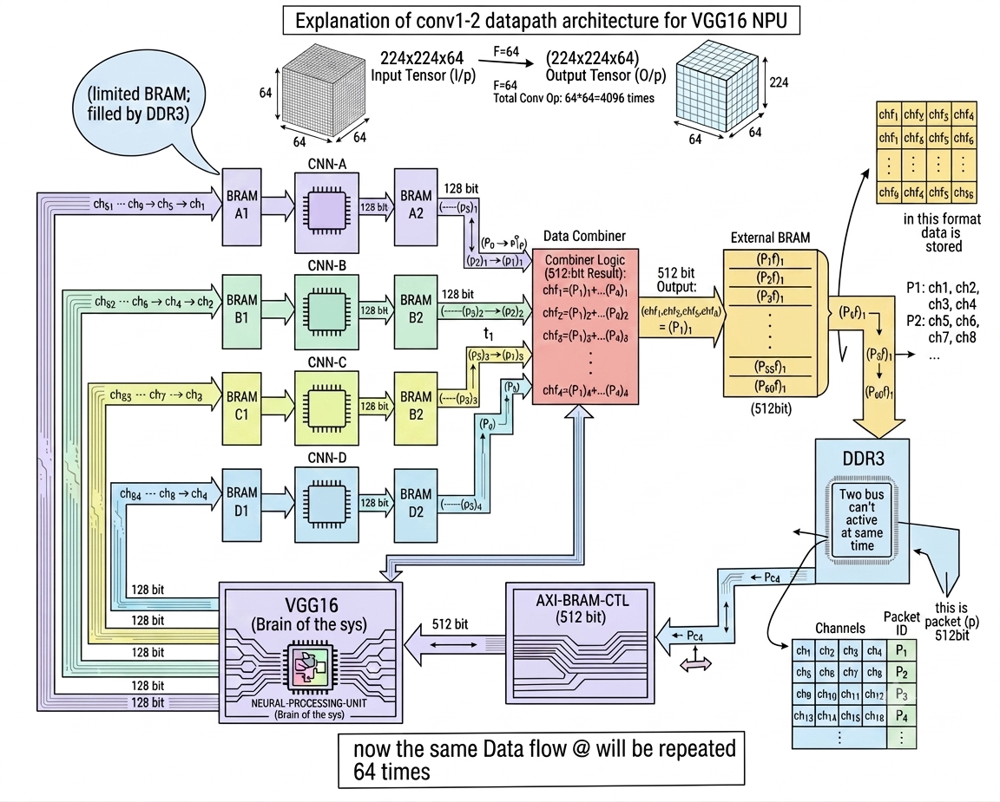
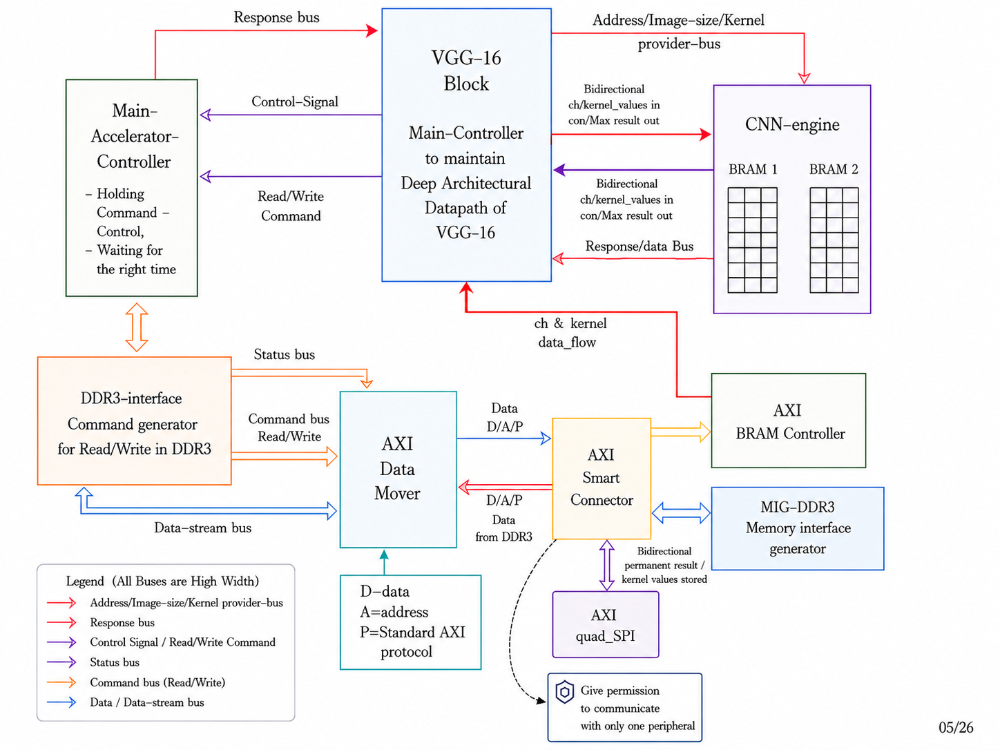
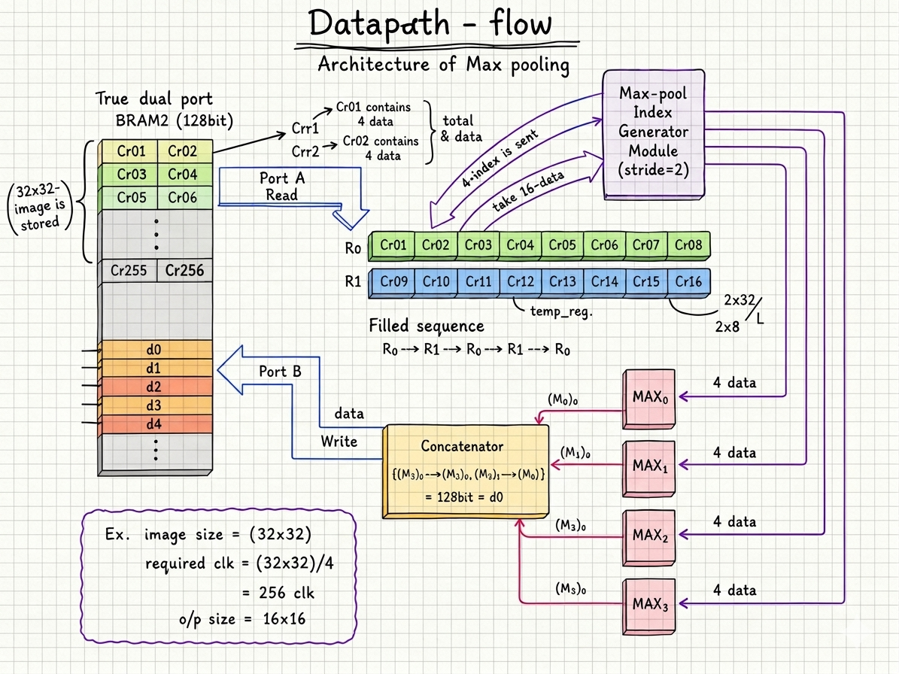
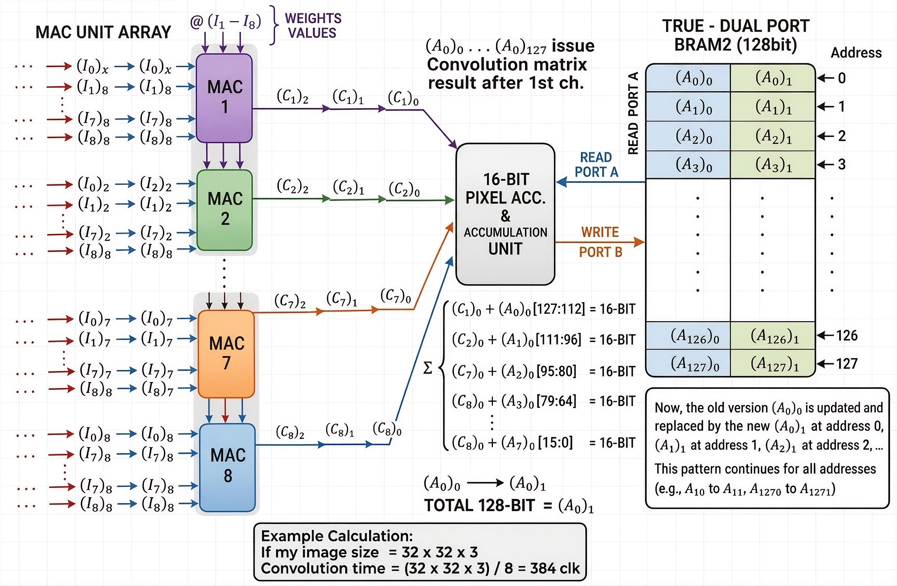
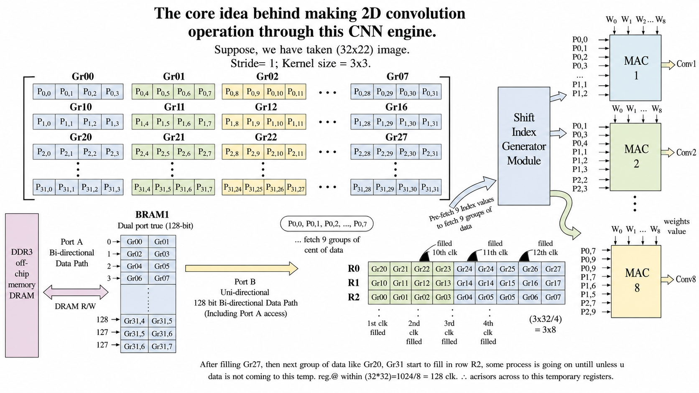
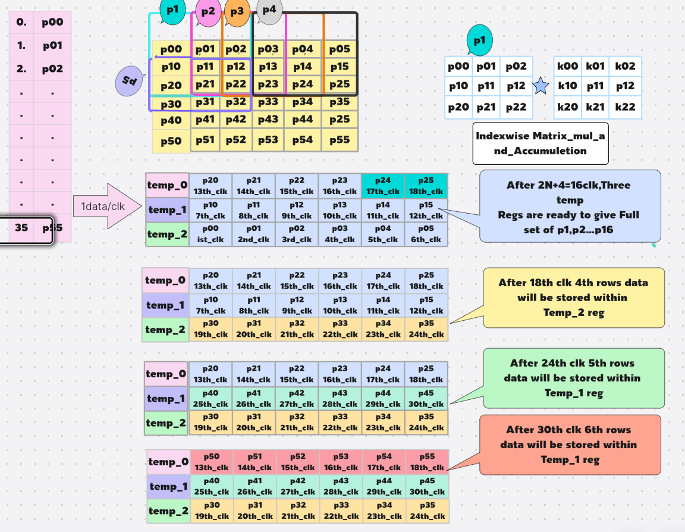
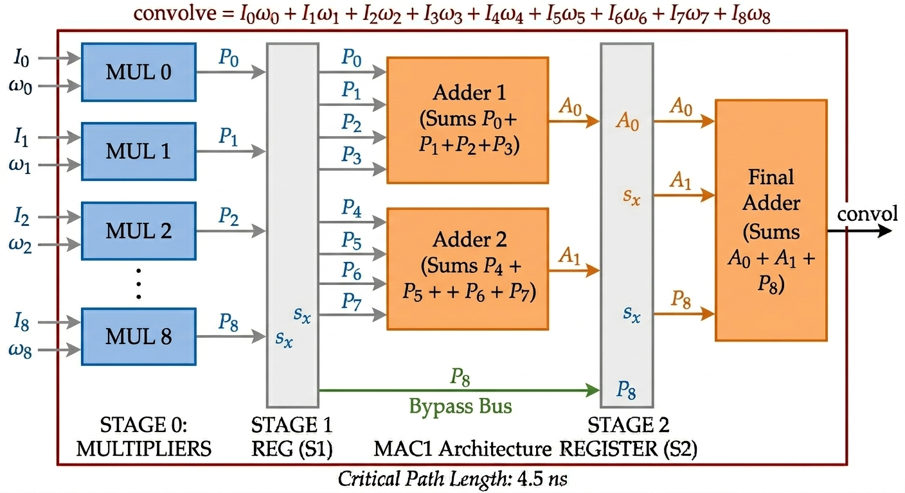
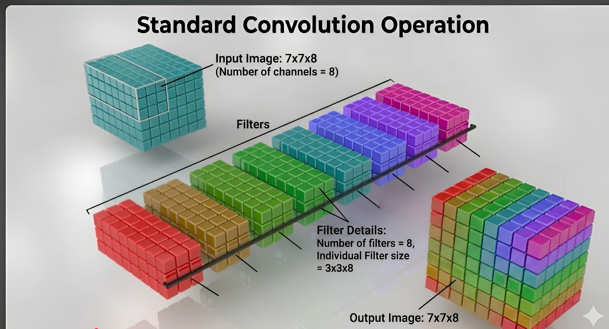

# FPGA-Based Hardware Acceleration of VGG-16 Deep Convolutional Neural Network Using DDR3 for Real-Time AI Inference

A complete, silicon-ready hardware accelerator for the full VGG-16 deep neural network, designed from scratch in Verilog HDL and implemented on a Xilinx Virtex-7 VC707 FPGA. This project delivers a custom 4-engine parallel CNN accelerator with a DDR3-backed memory hierarchy, achieving **83.8 GOP/s** throughput at **4.62 W** — matching ASIC-class efficiency while retaining FPGA flexibility.

**Presented by:** Rabisankar Maity
**Under the supervision of:** Prof. Roy Paily Palathinkal
**Department of Electronics and Electrical Engineering, Indian Institute of Technology Guwahati**

---

##  Full Project Download

All RTL source files, simulation results, the full project presentation, and reference documentation are packaged together.

**[📁 Download Full Project (Google Drive)](https://drive.google.com/file/d/1-XOkdn0KZGbk76jt35BEpLkjuwYOc8G-/view?usp=drive_link)**
**[📁 Experimental Images & Screenshots (Google Drive Folder)](https://drive.google.com/drive/folders/10FEyOVszcu8QYUEyfChgpoxFOgg5Q2zA?usp=sharing)**

## ⚙️ Key Design Parameters

| Parameter | Value | Description |
|---|---|---|
| Data precision (w) | 16-bit fixed point | Pixel values, kernel weights, MAC outputs |
| Kernel size (k_size) | 3 × 3 | Fixed convolution kernel footprint |
| BRAM word width | 128 bits | 8 pixels per BRAM access |
| Parallel MAC units | 8 × 4 = 32 | 32 output pixels per clock cycle (4 channels in parallel) |
| Multipliers per MAC | 9 | Full 3 × 3 kernel coverage per unit |
| Total MACs/cycle | 72 × 4 = 288 | 8 × 9 × 4 |
| MAC pipeline depth | 2 cycles | Multiply stage + adder-tree stage |
| Circular buffer rows | 3 | One kernel height; modulo-3 rotation |
| 4-channel group size | 4 | BRAM1 image buffer capacity per refresh |
| DDR3 width | 64-bit physical | 8 DDR3 data byte lanes |
| AXI data width | 512-bit | Matches 4× BRAM word width |
| System clock | 200 MHz | After Xilinx clk_wiz_0 PLL |
| Supported image sizes | 224, 112, 56, 28, 14, 7 | All VGG-16 spatial feature map sizes |

##  The Problem

VGG-16 is a 16-layer convolutional neural network requiring:
- **138 million parameters**(includeing ANN part)
- **~15.5 billion multiply-accumulate (MAC) operations** per image( without ANN part)
- **292.67 MB** of total memory for weights, biases, and feature maps(with ANN part)
- **without ANN part Almost 30MB Space required.

A CPU takes *seconds* per inference. Meanwhile, a typical Virtex-7 FPGA has only **4 MB of on-chip BRAM** — a **73× memory gap** against what VGG-16 actually needs. Existing FPGA/ASIC solutions in literature solve this by either burning excessive power (10–35 W), consuming enormous DSP/LUT resources, or dropping to low-bit precision with severe latency penalties.

**Goal of this project:** Match ASIC-level performance and power efficiency, solve the memory wall, and retain full FPGA reconfigurability — all three simultaneously, without compromise.

**The headline result:** This work sustains **83.8 GOP/s at just 4.62 W** using only **300 DSPs** — a fraction of the DSP count used by comparable high-throughput FPGA designs (up to **9.6× fewer DSPs** than Yuan et al.'s VC709 implementation), while consuming **up to 7.5× less power** than other high-throughput FPGA accelerators in the same class. Against ASIC implementations, this design achieves **comparable or better throughput at similar power efficiency**, without sacrificing the reconfigurability that FPGAs uniquely offer.

## 🏗️ Top-Level Modules Summary of the CNN Accelerator System

| Module Name | Primary Function | Interface |
|---|---|---|
| CNN_accelerator_final | FSM compute engine; 8×MAC×2 parallel convolution + max pooling | Direct wire / BRAM |
| Block_controller_200 | Master orchestrator; layer sequencing, address management; DDR3↔BRAM data transfers | Direct wire / AXI4-Lite |
| mig_7series_0 | Xilinx MIG DDR3 controller; off-chip 512-bit burst R/W | AXI4 |
| axi_interconnect | AXI interconnect fabric; interface between master and slave ports | AXI4 |
| axi_bram_ctrl_0 | AXI-to-BRAM bridge for internal image/kernel BRAM (BRAM2) | AXI4-Lite |
| BRAM_address_adjuster | Translates logical BRAM addresses to physical port-A addresses during DDR3→BRAM1 base loads | Direct wire |
| ddr3_interface | Custom AXI master driver; burst read/write transactions to MIG; exposes simple handshake signals to Block Controller | AXI4 master |
| clk_wiz_0 | PLL-based clock generation; 200 MHz system clock | Clock |

---

## 🏗️ Architecture Overview

The system is built around **4 parallel CNN engines** (Engine A–D), each with its own dual-BRAM pair, orchestrated by a centralized VGG-16 control block that manages DDR3 traffic, AXI interconnects, and layer-wise scheduling.

```
CNN_A → BRAM_1A → BRAM_2A
CNN_B → BRAM_1B → BRAM_2B
CNN_C → BRAM_1C → BRAM_2C
CNN_D → BRAM_1D → BRAM_2D
```

- **72 parallel MAC units per engine** (8 × MAC-9 modules) → **288 MACs/cycle** across all 4 engines
- **200 MHz** clock, all four engines fully pipelined
- **512-bit AXI4** fabric connecting the CNN engines, DDR3 (via Xilinx MIG), AXI SmartConnect, AXI DataMover, and AXI BRAM Controller
- **Standalone MicroSD weight loading** via AXI Quad SPI — zero host/software dependency
- Hierarchical multi-FSM control: **Main FSM, MAC Control FSM, Accumulation FSM, and Max-Pool FSM**, all synchronized across the 200 MHz domain

### Core Engineering Insight: Minimizing DDR3 Traffic

The central design principle of this accelerator is **not** maximizing raw parallelism — it's minimizing off-chip DDR3 access, since DDR3 bandwidth (not compute) is the real bottleneck at this scale.

- From **Block 1 to Block 4**, feature map channels are streamed directly from DDR3 → BRAM, since keeping all channels on-chip simultaneously isn't possible at these resolutions.
- After **Block 4's max-pool**, output shrinks to 28×32×512 — small enough that its ~202 BRAM blocks worth of data can be cached fully on-chip, eliminating further DDR3 round-trips for Blocks 4–5. This single optimization is what allows the design to close the gap against much larger, power-hungry prior implementations.
- **DDR3 burst behavior is explicitly modeled in the datapath**: each burst delivers 4096 bytes with an inter-burst gap (2-clock minimum, designed conservatively for 4 clocks) — this timing was accounted for directly in the FSM design rather than treated as an afterthought.
- The core CNN engine is designed to accept **any row size**, with the constraint that **column size must be divisible by 8** — enabling the engine to handle every VGG-16 feature map size (224→112→56→28→14→7) through a single reusable, parameterized RTL block rather than per-layer custom hardware.

---
## 🛠️ Implementation Environment Summary

| Parameter | Value |
|---|---|
| FPGA Device | Xilinx Virtex-7 VC707 (xc7vx485tffg1761-2) |
| Design Suite | Xilinx Vivado 2016.4 |
| Simulation Tool | Vivado Simulator (XSim) |
| HDL Language | Verilog HDL |
| Target Clock | 200 MHz |
| Data Precision | 16-bit fixed point |
| Off-chip Memory | DDR3 SDRAM (64-bit bus, 2 GB) |
| Memory Controller | Xilinx MIG 7-Series |
| AXI Data Width | 512-bit |


##  Verification Approach

- Full **post-synthesis simulation** across every convolution block (Conv1.1 through Conv5.3), with measured per-layer latency matching hand-calculated theoretical values (e.g., Conv1.1: 4.07 ms measured vs. 4.07 ms calculated).
- **Layer-wise output correctness validated** via Python (OpenCV) — pixel extraction and feature map reconstruction confirmed against expected values, including a full edge-detection test on a real 224×224×3 RGB image.
- **Post-implementation timing closure**: 0 failing endpoints across 71,424 timing paths at 200 MHz (WNS: 0.063 ns).
- DDR3 read/write burst behavior verified at the waveform level to confirm correct AXI protocol compliance under back-to-back access patterns.

## 📊 Post-Implementation Report

| Resource | Utilization | Available | % |
|---|---|---|---|
| LUT | 98,735 | 303,600 | 32.52% |
| LUTRAM | 5,409 | 130,800 | 4.14% |
| FF | 77,375 | 607,200 | 12.74% |
| BRAM | 388 | 1,030 | 37.67% |
| DSP | 300 | 2,800 | 10.71% |

**Timing:** WNS 0.063 ns, 0 failing endpoints across 71,424 paths — all constraints met.
**Power:** 4.932 W total on-chip, 4.625 W dynamic, junction temp 30.6°C.

---

## 📸 Architecture & Implementation Visuals















## 📂 Repository Structure

| Folder / File | Description |
|---|---|
| [`MTP_Paper_VGG16_DDR3_IEEE_format.pdf`](https://github.com/vijay-2020-vijay/FPGA-Based-VGG-16-CNN-Hardware-Accelerator-with-DDR3-in-Xilinx-Virtex-7-VC707/blob/main/MTP_Paper_VGG16_DDR3_IEEE_formet.pdf) | Full project paper in IEEE format |
| [`VGG16_DDR3.pdf`](https://github.com/vijay-2020-vijay/FPGA-Based-VGG-16-CNN-Hardware-Accelerator-with-DDR3-in-Xilinx-Virtex-7-VC707/blob/main/VGG16_DDR3.pdf) | Full A-to-Z documentation report — complete design, implementation, and result details |
| [`VGG16_DDR3_PPT.pdf`](https://github.com/vijay-2020-vijay/FPGA-Based-VGG-16-CNN-Hardware-Accelerator-with-DDR3-in-Xilinx-Virtex-7-VC707/blob/main/VGG16_DDR3_PPT.pdf) | Full project presentation — architecture, results, and literature comparison |
| [`VGG16_Archi_plan_Images1`](https://github.com/vijay-2020-vijay/FPGA-Based-VGG-16-CNN-Hardware-Accelerator-with-DDR3-in-Xilinx-Virtex-7-VC707/tree/main/VGG16_Archi_plan_Images1) | Architecture planning diagrams and hardware module specifications (Part 1) |
| [`VGG16_Archi_plan_Images2`](https://github.com/vijay-2020-vijay/FPGA-Based-VGG-16-CNN-Hardware-Accelerator-with-DDR3-in-Xilinx-Virtex-7-VC707/tree/main/VGG16_Archi_plan_Images2) | High-level system blocks, memory mapping, and dataflow planning diagrams (Part 2) |
| [`VGG16_EXP_real_archi_Images2`](https://github.com/vijay-2020-vijay/FPGA-Based-VGG-16-CNN-Hardware-Accelerator-with-DDR3-in-Xilinx-Virtex-7-VC707/tree/main/VGG16_EXP_real_archi_Images2) | Hardware deployment block diagrams, Vivado IP setups, and VC707 board setups |
| [`VGG16_EXP_sim_Images1`](https://github.com/vijay-2020-vijay/FPGA-Based-VGG-16-CNN-Hardware-Accelerator-with-DDR3-in-Xilinx-Virtex-7-VC707/tree/main/VGG16_EXP_sim_Images1) | Behavioral simulation waveforms, testbench verification, and output feature maps |


| [`README.pdf`](https://github.com/vijay-2020-vijay/FPGA-Based-VGG-16-CNN-Hardware-Accelerator-with-DDR3-in-Xilinx-Virtex-7-VC707/blob/main/README.pdf) | Platform requirements and licensing notes — Vivado 2017 (licensed FPGA platform required) |
| `README.md` | Project documentation |


## Post-Synthesis and Implementation Results:


> ⚠️ **Platform Note:** This project was built and verified using a **licensed Xilinx Vivado 2017 installation**. A licensed FPGA platform/toolchain matching this version is required to reproduce synthesis and implementation results — see `README.pdf` for full platform and licensing requirements.

##  Designed for Reuse Beyond VGG-16

The core CNN computation engine is **fully parameterized** — not hardcoded to VGG-16 — supporting both standard and depthwise convolution:

- **Direct extensibility** to MobileNet-V2, YOLOv3, and YOLOv3-tiny through register-level configuration alone (no RTL changes required).
- **ResNet-18/50, GoogLeNet, and Inception-V4** support requires only extending the core engine to add 5×5/7×7 kernel support — the DDR3 interface, memory hierarchy, and FSM control fabric remain completely unchanged.

---

## 🔮 Future Work

| Direction | Expected Impact |
|---|---|
| **1024-bit AXI bus** (double current width) | Enables 8 parallel channels simultaneously; projected 184.5 ms latency, 167 GOP/s |
| **INT8 Quantization** | Same throughput gains as above, with saturating accumulators to manage overflow risk |
| **Line-buffer streaming** | Fetch multiple pixels/cycle to feed more engines in parallel; reduces LUT usage |
| **On-chip memory optimization** | Maximize on-chip caching to further reduce DDR3 dependency (FPGA); current ASIC baseline is already highly competitive |

---

## 📚 References

1. Y.-H. Chen, T. Krishna, J. Emer, V. Sze, "Eyeriss: An Energy-Efficient Reconfigurable Accelerator for Deep Convolutional Neural Networks," *IEEE JSSC*, vol. 52, no. 1, pp. 127–138, Jan. 2017.
2. K. Simonyan, A. Zisserman, "Very Deep Convolutional Networks for Large-Scale Image Recognition," *ICLR*, 2015.
3. K. He, X. Zhang, S. Ren, J. Sun, "Deep Residual Learning for Image Recognition," *IEEE CVPR*, pp. 770–778, 2016.
4. A. Howard et al., "Searching for MobileNetV3," *IEEE/CVF ICCV*, pp. 1314–1324, 2019.
5. M. Tan, Q. V. Le, "EfficientNet: Rethinking Model Scaling for CNNs," *ICML*, pp. 6105–6114, 2019.
6. Xilinx Inc., "Virtex-7 FPGA Family Data Sheet DS183." [Link](https://www.xilinx.com/support/documentation/data_sheets/ds183_Virtex_7_Data_Sheet.pdf)

*(Full reference list with all literature comparison entries available in the project presentation.)*

---

## 👤 Author

**Rabisankar Maity**
VLSI M.Tech Graduate, IIT Guwahati — AIR 318 in GATE EC
Feel free to connect, raise issues, or fork this project for your own experiments.
